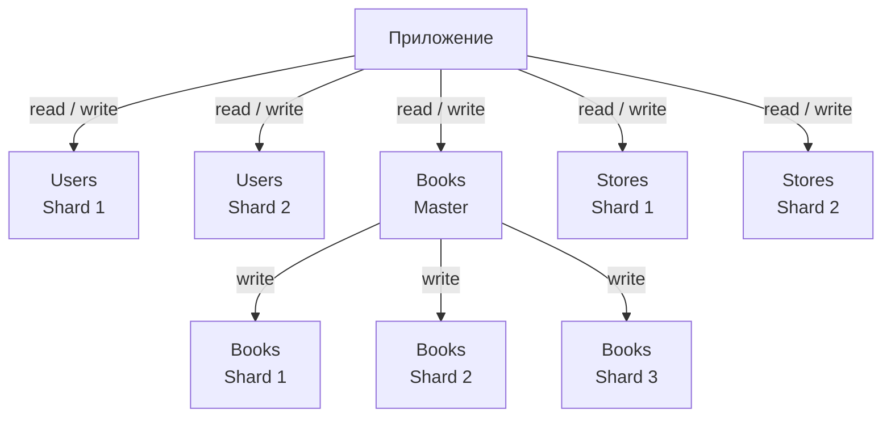

# Домашнее задание к занятию «Репликация и масштабирование. Часть 2»  - Харьков Никита             

## Задание 1

Опишите основные преимущества использования масштабирования методами:

- активный master-сервер и пассивный репликационный slave-сервер; 
- master-сервер и несколько slave-серверов;

*Дайте ответ в свободной форме.*

---
## Решение 1

### 1. Активный master-сервер и пассивный репликационный slave-сервер

### Преимущества
- **Повышение отказоустойчивости.** При сбое master можно быстро переключиться на slave.
- **Разгрузка master-сервера.** Чтение можно перенести на slave, уменьшив нагрузку на основной узел.
- **Безопасное резервное копирование.** Бэкапы делаются со slave, не влияя на производительность master.
- **Простота внедрения.** Лёгкая настройка и минимальные изменения архитектуры.

### 2. Master-сервер и несколько slave-серверов

## Преимущества
- **Горизонтальное масштабирование чтения.** Несколько slave позволяют обслуживать гораздо больше запросов SELECT.
- **Балансировка нагрузки.** Запросы могут распределяться между репликами.
- **Высокая доступность.** При отказе одного slave его роль подхватывают остальные.
- **Гибкость.** Можно выделить отдельные реплики для аналитики, отчётов, бэкапов и т. д.
- **Изоляция тяжёлых запросов.** Сложные отчёты не нагружают основной master.

---

## Задание 2

Разработайте план для выполнения горизонтального и вертикального шаринга базы данных. База данных состоит из трёх таблиц: 

- пользователи, 
- книги, 
- магазины (столбцы произвольно). 

Опишите принципы построения системы и их разграничение или разбивку между базами данных.

*Пришлите блоксхему, где и что будет располагаться. Опишите, в каких режимах будут работать сервера.* 
## Решение 2

# План вертикального и горизонтального шаринга базы данных

## 1. Общая идея

Для обеспечения масштабируемости и стабильной работы системы используется разделение данных между серверами.  
В базе данных используются три таблицы:

- пользователи;
- книги;
- магазины.

Для распределения нагрузки применяются:
- вертикальный шардинг;
- горизонтальный шардинг;
- репликация.

---
## 2. Вертикальный шардинг

Вертикальный шардинг - это разделение таблиц по столбцам, когда разные группы данных хранятся на разных серверах.

### 2.1 Таблица `users`

Таблица пользователей разделяется на две части:

**Сервер 1 - основные данные пользователя**
- `user_id`
- `name`
- `email`

Эти данные часто используются при работе с профилями и списками пользователей.

**Сервер 2 - служебные и редко используемые данные**
- `user_id`
- `password_hash`
- `settings`
- дополнительные данные профиля

Связь между таблицами осуществляется по полю `user_id`.  
Объединение данных выполняется на уровне приложения.

---

## 3. Горизонтальный шардинг

Горизонтальный шардинг - это разделение таблиц по строкам между несколькими серверами.

### 3.1 Таблица `users`

Пользователи распределяются по серверам по идентификатору пользователя.

Пример:
- **Shard 1** - `user_id` от 1 до 1 000 000
- **Shard 2** - `user_id` от 1 000 001 и выше

Приложение заранее знает, на какой сервер отправлять запрос.

---

### 3.2 Таблица `books`

Книги распределяются по категориям.

Пример:
- **Shard 1** - категории 1–3
- **Shard 2** - категории 4–6
- **Shard 3** - категории 7–9

На основном сервере создаётся общее представление, через которое приложение работает с книгами как с одной таблицей.

---

### 3.3 Таблица `stores`

Магазины распределяются по регионам.

Пример:
- один сервер хранит магазины одного региона;
- другой сервер - магазины другого региона.

---

## 4. Режимы работы серверов

Для каждого шарда используется репликация:

- **Master-сервер**
  - режим работы: `read/write`;
  - выполняет операции записи и изменения данных.

- **Replica-сервер**
  - режим работы: `read-only`;
  - используется для выполнения запросов на чтение.

Запись данных всегда выполняется на master-сервер, чтение - преимущественно с replica.

---

## 5. Схема размещения компонентов

